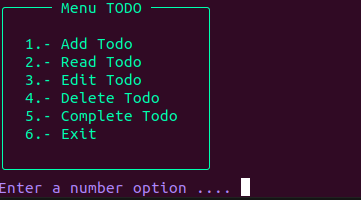
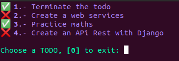

# TODO terminal python

This is an TODO done in Python for users. In this TODO you can put your pending tasks and obtain the information of these in addition to validating the ones you already did. This TODO works clearly on the console which makes it faster and more manageable to use in addition to having a colorful and friendly interface, lets go.

## Features
In this TODO you can use the following
- Create
- Read
- Update
- Delete
- Complete





## Installation

Install the dependencies and start.

In linux
```sh
python3 -m venv venv
source venv/bin/activate
pip install -r requirements.txt
python3 main.py
```

## License

MIT